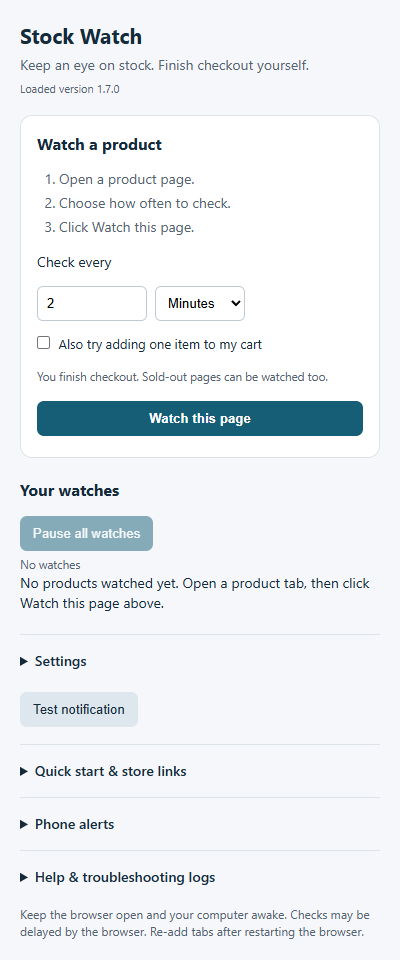

# Stock Watch

**Watch a product page and get an alert when its purchase button becomes available.** You can also choose to let the extension try adding one item to your cart. You finish checkout yourself.

Works in desktop Google Chrome. No programming, terminal commands, or paid subscription required for installation.

## Install in a few minutes

1. **[Download Stock Watch](https://github.com/MasoodMS95/Stock-Watch/archive/refs/heads/main.zip).** Or click the green **Code** button above, then **Download ZIP**.
2. **Extract the ZIP.** On Windows, right-click it and choose **Extract All**. Keep the extracted folder somewhere permanent, such as Documents. Do not delete or move it after installation.
3. **Open Chrome's Extensions page.** Paste `chrome://extensions` into Chrome's address bar and press Enter.
4. **Turn on Developer mode** using the switch in the top-right corner.
5. **Click Load unpacked.** Select the extracted **Stock-Watch-main** folder containing `manifest.json`. If you see another folder inside it, open that folder first.
6. **Pin the extension.** Click Chrome's puzzle-piece icon, then the pin beside **Personal Stock Watch**.

That's it. This is a community preview installed directly from GitHub; it is not a Chrome Web Store download.

## Watch your first product

1. **Open the product you want** in Chrome. Sign in to the store normally and set your delivery address or pickup store.
2. **Click Stock Watch** in Chrome's toolbar.
3. **Choose how often to check**, using seconds or minutes. The starting interval is two minutes; you can change it.
4. **Click Watch this page.** Allow access to that store if Chrome asks.
5. **Click Test notification** to make sure desktop alerts work.

Repeat those steps for other products. You can start while an item says **Sold out** or **Coming soon**—the purchase button does not need to be available yet.

**Keep Chrome open and your computer awake.** Closing the laptop lid or letting the computer sleep stops reliable monitoring. After restarting Chrome, re-add your product tabs.

<details>
<summary>See the interface</summary>



</details>

## What happens when something becomes available?

- **Alerts only — the default:** Stock Watch alerts you when it detects an enabled purchase button. Open the store tab and try purchasing yourself. A visible button does not guarantee inventory.
- **Optional cart attempt:** Before adding a watch, check **Also try adding one item to my cart**. The extension attempts the supported cart flow and reports its result. Some stores, especially Amazon, need further checks before an alert. It never clicks the final order button.

Read the status beneath each product to see what the extension is doing. A queue or successful cart attempt is not a guaranteed reservation or purchase.

## Pause, resume, or stop

| You want to… | What to click |
| --- | --- |
| Pause one product | **Pause** on its watch |
| Start it again | **Resume** on its watch |
| Pause or resume everything | The button above **Your watches** |
| Stop watching a product | **Remove** on its watch |
| Change its interval or shipping option | **Settings & details** on its watch |

Check your cart before resuming a watch that already attempted an addition, so you do not request another item accidentally.

### Keep other windows running

In **Settings**, **Automatically select tabs while refreshing** is on by default. It brings pages forward to help them load, and an alert pauses all watches.

Turn it off if you keep stores in separate windows. Then only the alerted watch pauses, while the other watches continue without taking focus. Your manual pauses are respected.

## Stores and delivery options

Built-in rules are available for the **US websites** below. Compatibility varies by product and page layout; try your intended product before relying on it.

| Store | Default option | Notes |
| --- | --- | --- |
| Amazon | Shipping | Cart badges and prices alone do not prove availability. Some preorder/Buy Now flows require manual handling. |
| Best Buy | Pickup | Uses your saved store. Recognized queues are protected from refreshing. |
| Nintendo | Shipping | Product and single-item cart watches are supported. |
| Walmart | Shipping | Pickup and local delivery are also available in the fulfillment settings. |
| GameStop | Shipping | Availability and prompts can vary by location. |

Choose fulfillment in **Settings** before adding a watch, or change it in the watch's **Settings & details**. On other sites, advanced button selection may help, but there is no general guarantee of support.

## Get alerts on your phone

Phone alerts are optional and use [ntfy](https://ntfy.sh).

1. Open **Phone alerts** in Stock Watch.
2. Click **Enable phone alerts** and allow access to `ntfy.sh`.
3. Install the ntfy app on your phone. Subscribe to the exact topic shown in Stock Watch, using `ntfy.sh` as the server. The extension also explains the iPhone Home Screen web-app option.
4. Allow phone notifications, then click **Send phone test** in Stock Watch.
5. Lock your phone and confirm the test arrives before relying on alerts.

Keep the topic private: anyone who knows it can read or send messages to it. Phone alerts follow the same alert events as desktop notifications. Your computer must remain awake with Chrome open.

## If something isn't working

| Problem | Try this |
| --- | --- |
| Chrome says the manifest is missing | Extract the ZIP first, then select the folder directly containing `manifest.json`. |
| “Open a store product page first” | Switch to the actual product tab and open the extension from there. |
| No desktop alert | Click **Test notification**. Check Chrome notification permissions and your computer's Do Not Disturb settings. |
| A watch paused | Read its status and inspect the store tab. Resolve any sign-in or verification prompt yourself, then resume when appropriate. |
| Refreshes seem delayed | Keep the computer awake. Allow the page to load; background tabs and store responses can delay checks even with a short interval. |
| Phone test does not arrive | Check the exact topic, notification permissions, network connection and Focus/Do Not Disturb settings. |
| Something else goes wrong | Expand **Help & troubleshooting logs**, export a log, and [open an issue](https://github.com/MasoodMS95/Stock-Watch/issues). Include your version, store, and what happened. Review the log before sharing it publicly. |

Security challenges, password entry and two-factor authentication may need your attention. An optional Nintendo setting can confirm a password already autofilled by your browser; it does not read or store the password.

## Update an existing installation

1. Pause your watches and check for any active cart attempt or queue.
2. Download and extract the latest ZIP.
3. Copy its contents into the **same folder you originally loaded**, replacing the old files.
4. Open `chrome://extensions` and click **Reload** on Personal Stock Watch.
5. Open Stock Watch and confirm the loaded version is **1.7.0**, then test notifications and review your watches.

There is no automatic updater in this preview.

## Privacy

Stock Watch uses the store sessions you already have in Chrome. You do not enter your credentials into the extension.

- Watch settings and diagnostic logs are stored on your computer.
- Logs record progress, pause reasons and limited page facts. They do not intentionally capture passwords, cookies, screenshots or full page HTML. Exported logs can still contain product and browsing-related information, so review them before posting.
- When you enable phone alerts, notification text and a product link are sent through `ntfy.sh`.
- This repository contains program files and synthetic tests, not anyone's saved watches, browser session, phone topic or diagnostic exports.

## Technical details

### Architecture

Chrome Manifest V3 extension, minimum Chrome version 120. Runtime code is plain JavaScript, HTML and CSS, with no build step or runtime package dependencies.

| Files | Responsibility |
| --- | --- |
| `background.js`, `work-queue.js` | Watch state, scheduling, action coordination, pauses and recovery |
| `profiles.js`, `detector.js`, `availability.js` | Store rules, purchase-button detection and page observation |
| `cart.js`, `actions.js` | Guarded cart actions and result classification |
| `amazon.js`, `bestbuy.js`, `nintendo.js` | Store-specific flow inspection and recovery |
| `foreground.js`, `page-timers.js` | Tab activation and refresh timing |
| `popup.*`, `watch-ui.js` | Setup, watch list and controls |
| `phone.js`, `phone-ui.js` | Optional ntfy delivery and setup |
| `diagnostic*.js`, `diagnostics*.js` | Bounded local logs, analysis and export |

The service worker persists watch state in `chrome.storage.local`. Cart actions carry attempt tokens; manual pauses and pending operations protect against conflicting refreshes. Short intervals are supported, but Chrome scheduling and page loading prevent a hard real-time guarantee.

The Amazon checkout-entry exception is currently restricted to ASIN `B0HJ6F8L6V` and its observed preorder control and endpoint. Other product rules are broader, but arbitrary checkout flows are not automatically supported. Cart count, subtotal and button text are not treated as verified Amazon inventory.

### Permissions

- `tabs`: locate and refresh watched tabs.
- `scripting`: inspect pages and execute enabled, guarded actions.
- `storage`: persist preferences, watch state and related data.
- `alarms`: schedule work and recovery.
- `notifications`: desktop alerts.
- Optional HTTP/HTTPS host permissions: requested for each store when a watch is added. Optional ntfy and Nintendo account access are requested when their features are enabled.

### Run the tests

Contributors need Node.js 22 or later. Users installing the extension do **not** need Node.js.

```sh
npm test
```

This runs all `*test.cjs` suites with Node's built-in modules. No `npm install` is required. Tests simulate Chrome APIs, clocks, store pages and phone responses; they do not place orders or send real phone notifications. Passing tests do not establish live compatibility with every retailer page.

For the separate browser IndexedDB fixture:

```sh
node diagnostics-test-server.cjs
```

Open `http://127.0.0.1:8768/diagnostics-browser-test.html`, check for PASS, then stop the server.

To analyze a diagnostic export locally:

```sh
node analyze-log.cjs path-to-export.json
```

When contributing a fix, include a regression test using synthetic or redacted page evidence. Do not commit account data, phone topics or diagnostic exports.
